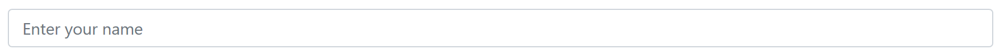
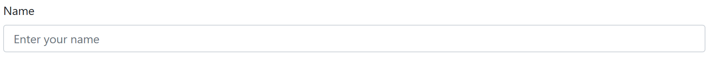
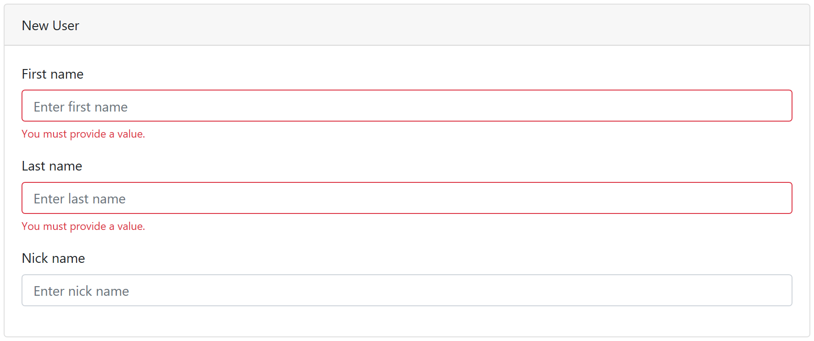
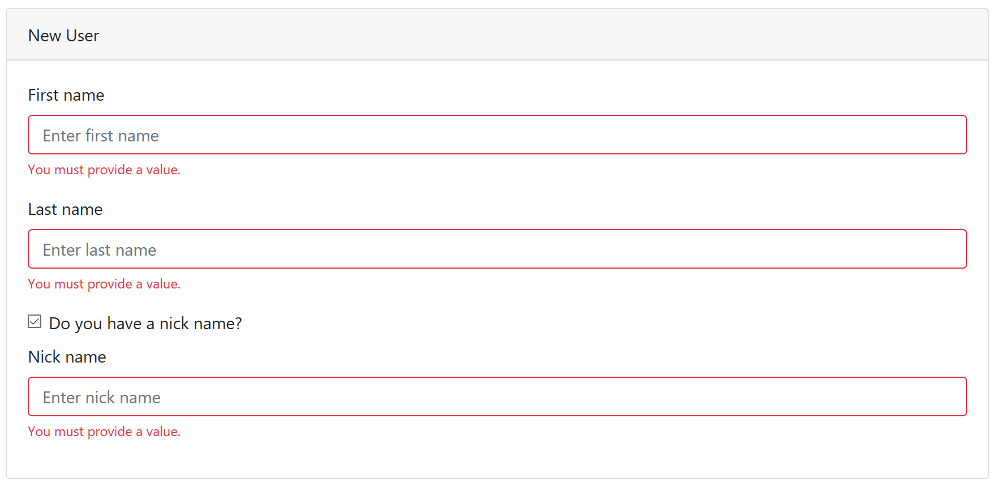

# Why and what is formlets?

A few years ago I was trying out [WebSharper](http://websharper.com/). There was much I didn't understand about WebSharper but I fell in love with the concept of Formlets/Piglets. For years I have been trying to make others see it as I do; an awesome and productive way to build reactive Forms that have validation.

Formlets are not a generic solution to all UI related problems but they are awesome for Forms (as the name implies).

Like parsers combinators like FParsec allows us build complex parsers from simple and generic building blocks Formlets allows us to build forms from simple and generic input elements.

One of the simplest forms is a simple text input element:

```fsharp
let f = text "Enter your name" ""
```



We can add a label to it:

```fsharp
let f = text "Enter your name" "" |> withLabel "name-id" "Name"
```



We can create our input formlet with formlet by creating a function

```fsharp
let input lbl hint validation =
  text hint ""                // Text input
  |> validation               // Apply validation
  |> withLabel lbl lbl        // label the text input
  |> withValidationFeedback   // Display validation failures
  |> withFormGroup            // Wrap it in a form-group (Bootstrap)
```

There is a formlet computation expression which allows us to combine several inputs

```fsharp
let newUser : Formlet<string*string*string> =
  formlet {
    let! firstName  = input "First name" "Enter first name" notEmpty
    let! lastName   = input "Last name"  "Enter last name"  notEmpty
    let! nickName   = input "Nick name"  "Enter nick name"  yes
    return firstName, lastName, nickName
  } |> withCard "New User"
```



We can make a slight validation of the Formlet above by showing the user a checkbox that they tick if they like to enter a nick name.

```fsharp
let newUser : Formlet<string*string*string option> =
  formlet {
    let! firstName  = input "First name" "Enter first name" notEmpty
    let! lastName   = input "Last name"  "Enter last name"  notEmpty
    let! hasNick    = checkBox "has-nick" "Do you have a nick name?"
    let! nickName   =
      if hasNick then input "Nick name"  "Enter nick name"  notEmpty |>> Some
      else value None
    return firstName, lastName, nickName
  } |> withCard "New User"
```



The cool thing is that the user will see a checkbox that when ticked will display a required text input for the nick. Normally optional behavior in forms require some kind of event handling, not so with formlets.


I think Formlets are a great way to create great forms quickly and I wished more developers talked about them.

## What is fable-formlets?

What is great about formlets is that they can be built upon almost any UI frameworks. `fable-formlets` is a small formlet library to demonstrate formlets running on top of Fable.Elmish Model-View-Update architecture.

Currently `fable-formlets` is merely a functionally demo and not a serious library.

The core type is `Formlet<_>`

```fsharp
type Formlet<'T> = Ft of (FormletPath -> Model -> Dispatcher -> 'T*ViewTree*FailureTree)
```

That is; a formlet is function that given a path that indicates where we are in the model, the current model element and a dispatcher (that allows the view element dispatch a message to update the model). This function produces a value 'T, a view tree and a failure tree.

A formlet always produces a value in order to make `bind` not shortcut the rest of the formlet. The value is valid if the `FailureTree.IsGood x` is `true`.

As a formlet isn't directly usable in a Formlet.Elmish application, there are functions that convers a formlet into a form.

```fsharp
type Form<'Model, 'Msg> = F of ('Model -> ('Msg -> unit) -> ReactElement)
```

A Formlet.Elmish application uses `Form.view` and `Form.update` to render and update the form.

For formlet we define the usual combinators; `bind`, `apply`, `map` and a few others. While `bind` is one of the most flexible ways to compose formlets it is preferable to use `apply` for performance reasons, like so:

```fsharp
let address lbl =
  // <*> is apply
  value Address.New
  <*> input "Carry over"  ""  Validate.yes
  <*> input "Name"        ""  Validate.notEmpty
  <*> input "Street"      ""  Validate.notEmpty
  <*> input "Street"      ""  Validate.yes
  <*> input "Street"      ""  Validate.yes
  <*> input "Zip"         ""  Validate.notEmpty
  <*> input "City"        ""  Validate.notEmpty
  <*> input "County"      ""  Validate.yes
  <*> input "Country"     ""  Validate.notEmpty
  |> withCard lbl
```

Part of Core.fs is also a set of validators to demonstrate how to validate formlets.

## Bootstrap

Core.fs contains generic functionality, however in order to build nice looking forms Boostrap is a pretty neat CSS library. Boostrap.fs contains Bootstrap specific elements.

For example this is how the text input is defined:

```fsharp
let text hint initial : Formlet<string> =
  Ft <| fun fp m d ->
    let v =
      // Model needs to be deconstructed. If the model isn't a value
      //  the model is being initially constructed or has changed shape
      //  because of other changes to the model, if so assume the initial value
      match m with
      | Model.Value v -> v
      | _             -> initial

    let aa : IHTMLProp list =
        [
          DefaultValue  v
          OnBlur        <| fun v -> update d (box v.target :?> Fable.Import.Browser.HTMLInputElement).value
          Placeholder   hint
        ]

    let tvt = delayedElement input aa "form-control" []

    v, tvt, zero ()
```

## References

1. [WebSharper](http://websharper.com/) - Where I first saw the formlet concept
2. [Haskell formlets](https://chrisdone.com/posts/haskell-formlets) - Not surprisingly Haskell people has been thinking about Formlets for a long time.
